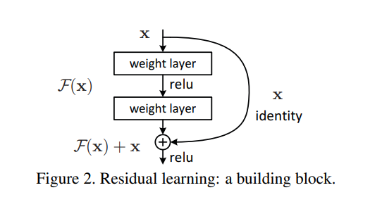
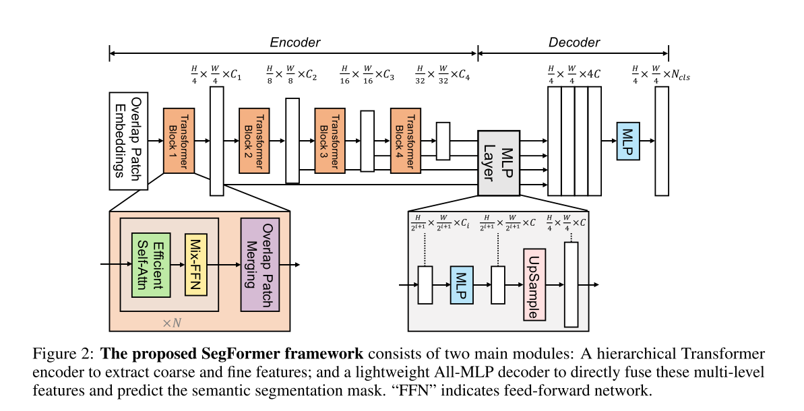

# Deep Learning Guide

帮助初学者快速上路（入门），了解如何搭建深度网络，可以根据需要进行模块化快速搭建
主要分为三个部分
1. backbone
2. dataloader
3. trick

backbone部分汇总了主流的特征提取结构  
dataloader部分给出了不同数据集如何读取的模板，以手部姿态估计方向数据集为例  
trick部分汇总近期前沿论文提出的新方法（即插即用模块）

对于结构创新可以从第一部分和第三部分入手

# 1.backbone

## 1. resnet  

### 1）resnet  
论文：https://arxiv.org/abs/1512.03385  
官方代码：https://github.com/pytorch/vision/blob/main/torchvision/models/resnet.py  
结构图:  
[](https://github.com/JiaoZixun/Deep-Learning-Guide/blob/main/others/img_resnet/resnet01.jpg)  
要点:  

``` python
                                        # torch.Size([2, 3, 256, 256])
x = self.conv1(x)                       # torch.Size([2, 64, 128, 128])
x = self.bn1(x)                         # torch.Size([2, 64, 128, 128])
x = self.leakyrelu(x)                   # torch.Size([2, 64, 128, 128])
x = self.maxpool(x)                     # torch.Size([2, 64, 64, 64])
x = self.layer1(x)                      # torch.Size([2, 256, 64, 64])
x = self.layer2(x)                      # torch.Size([2, 512, 32, 32])
x = self.layer3(x)                      # torch.Size([2, 1024, 16, 16])
x = self.layer4(x)                      # torch.Size([2, 2048, 8, 8])
x = x.mean(3).mean(2)                   # torch.Size([2, 2048])
x = x.view(x.size(0), -1)               # torch.Size([2, 2048])
x = self.fc(x)                          # torch.Size([2, 1000])
return x
```
使用指南:  
1. 先运行check_model.py 可以看到每一层输出的大小，输入都是三通道256*256大小的tensor  
resnet50经过四层从64通道增加到2048通道
```
self.layer2 = self._make_layer(block, 128, layers[1], stride=2) # 通过这个调节
```
最后的预测可以调整fc，num_classes就是你需要预测的类别
```
self.fc = nn.Linear(512 * block.expansion, num_classes)
```
### 2） Unet  
论文:  
官方代码:  
结构图:  
要点:  
使用指南:  

## 2. transformer  

### 1） segformer  
论文：https://arxiv.org/abs/2105.15203  
官方代码：https://github.com/NVlabs/SegFormer  
结构图:  
[  ](https://github.com/JiaoZixun/Deep-Learning-Guide/blob/main/others/img_segformer/segformer.jpg)  
要点:  

``` python
# MixVisionTransformer类对图像进行下采样，然后送入transformer得到多头注意力的权重，再重新合并为图像、
# block1：256, 256, 3 => 64, 64, 32  => 4096, 32 => (transformer) 4096, 32
# block2：64, 64, 32  => 32, 32, 64  => 1024, 64 => (transformer) 1024, 64
# block3：32, 32, 64  => 16, 16, 160 => 256, 160 => (transformer) 256, 160
# block4：16, 16, 160 => 8, 8, 256   => 64, 256  => (transformer) 64, 256
```
使用指南：
1. 先运行check_model.py 可以看到每一层输出的大小，输入都是三通道256*256大小的tensor  
segformer_b0经过四层从3通道增加到256通道  
具体每一层通道变化根据embed_dims=[32, 64, 160, 256]参数调节  
在init_checkpoints中给出了b0的初始化权重，下载其他权重放入该文件夹即可

文件下载：

链接：https://pan.baidu.com/s/1b5hLcblosjx-H-8p6OUJfw?pwd=g88t 
提取码：g88t   


# 2. dataloader

# 3. trick